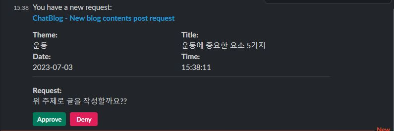
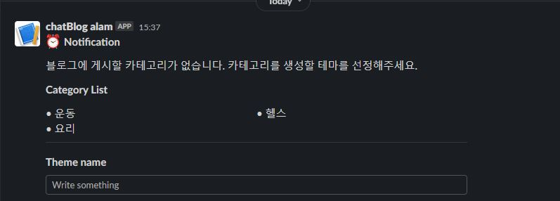
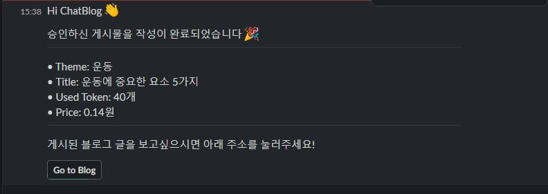

# **Introduction**

* 블로그 게시물 작성이 어려우신가요?
* 블로그를 작성할 시간이 없으신가요?
* 블로그 관리에 어려움을 느끼시나요?

<u>ChatBlog가 이 어려움을 해결해 드립니다.</u>

- [x] 게시물 자동 작성
- [x] 블로그에 자동 포스트
- [x] 슬랙을 통한 알림 및 피드백

# **Usage**
### **1. OpenAI Setting**

### **2. Slack Setting**

### **3. Tistory Setting**

### **4. Agent Run**

# **Run Test**

# **Demo**
### **Slack messanger demo**
* approval message

* input message

* notification message

### **Slack sample message**

# **Author**

# **License**